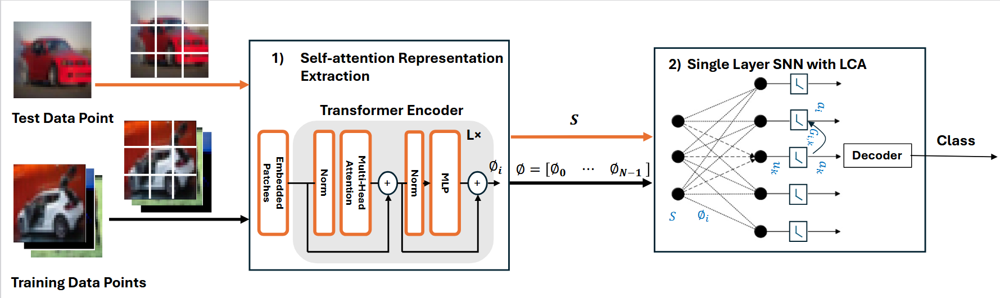

This work introduces ViT-LCA, a novel model that integrates Vision Transformers (ViT) with the Locally Competitive Algorithm (LCA) to enable energy-efficient deployment on neuromorphic platforms. By leveraging ViT's self-attention mechanisms to extract contextual embeddings and combining them with LCA's sparse coding within a single-layer spiking neural network, ViT-LCA achieves high classification accuracy on datasets such as CIFAR-10, CIFAR-100, and ImageNet-1K. The model extracts self-attention representations once and stores them in non-volatile memory, facilitating in-memory computation and significantly reducing energy consumption compared to other spiking vision transformer models. The approach eliminates the need for dictionary training, as required in traditional LCA, and demonstrates compatibility with memristor crossbar arrays for efficient neuromorphic implementation. ViT-LCA's performance highlights its potential for low-power, high-efficiency AI systems, paving the way for further exploration of transformer-based architectures in neuromorphic computing.
[📄 Read the full paper (PDF)](../files/ViT_LCA.pdf)
