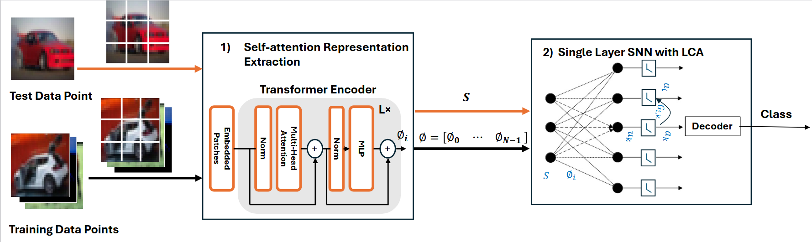

A Low-Power Approach for Vision Transformers:

The recent success of Vision Transformers has sparked significant interest in attention mechanisms and transformer architectures. Although existing methods have proposed spiking self-attention mechanisms compatible with spiking neural networks, they often face challenges in effective deployment on current low-power computing platforms. This paper introduces a novel model that combines vision transformers with the Locally Competitive Algorithm (LCA) to facilitate efficient low-power deployment. Our experiments show that ViT-LCA achieves higher accuracy on the ImageNet-1K dataset while consuming significantly less energy than other spiking vision transformer counterparts. Furthermore, ViT-LCA’s low-power-friendly design allows for more direct mapping onto current low-power computing architectures.