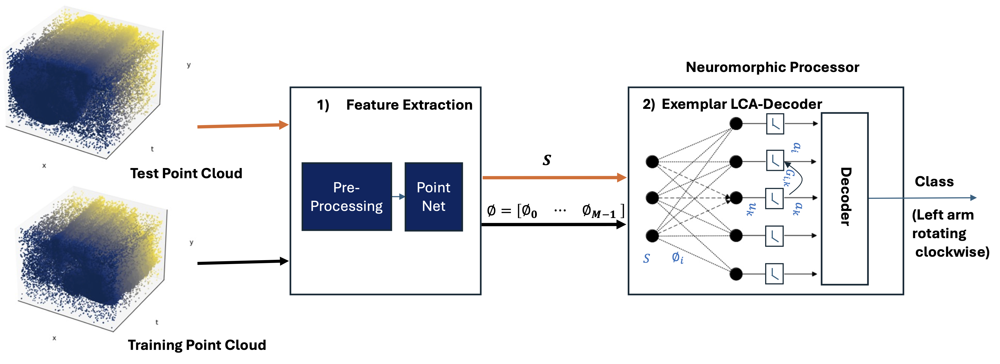

PointLCA-Net leverages the strengths of PointNets for extracting robust features from input point sets, while utilizing the efficiency of Exemplar LCA Encoder-Decoder for low-power Computer Vision applications.  
PointLCA-Net leverages the strengths of PointNets for extracting robust features from sparse spatio-temporal point cloud data, while utilizing the efficiency of the Exemplar Locally Competitive Algorithm (LCA) Encoder-Decoder for energy-efficient deployment on neuromorphic systems. By processing Dynamic Vision Sensor (DVS) event streams as 3D point clouds, PointLCA-Net extracts geometric and temporal features using PointNet architectures, which are then encoded and decoded by the Exemplar LCA for classification tasks. The model achieves high recognition accuracies of up to 94.41% on the DVS128 dataset, 99.01% on NMNIST, and 78.46% on Spiking Heidelberg Digits (SHD), surpassing other spiking neural network approaches for point clouds. Features are extracted once and stored in non-volatile memory, enabling in-memory computation with up to 99.54% reduction in computational effort during inference. PointLCA-Net’s compatibility with neuromorphic hardware, such as RRAM crossbar arrays, and its low energy consumption (e.g., 0.065 mJ on DVS128) make it highly suitable for energy-constrained applications like robotics and unmanned aerial vehicles. This work demonstrates a scalable, neuromorphic-friendly approach for processing complex spatio-temporal signals, offering significant potential for low-power computer vision systems.
[📄 Read the full paper (PDF)](../files/PointLCA-Net.pdf)
