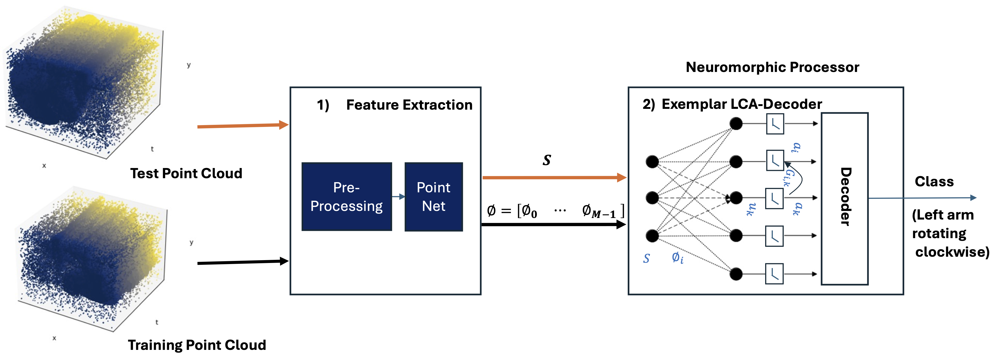

Exemplar LCA Encoder-Decoder:

In recent years, the field of neuromorphic computing has gained significant traction as the demand for AI applications in energy-constrained autonomous systems, such as unmanned aerial vehicles (UAVs) and robotics, continues to grow. The advent of Dynamic Vision Sensor (DVS) and other event-based sensors, which generate sparse spatio-temporal signals, has propelled the field of low-power computing. This advancement calls for the development of new machine learning models or the refinement of existing ones to effectively leverage neural dynamics and exploit spike-based communication among neurons. These sparse spatio-temporal signals can be treated as 3D point sets (point clouds), representing the space and time at which these events occur, and can be processed using PointNet architectures. However, applying deep learning techniques such as backpropagation and deploying these models on energy-constrained low-power devices presents challenges in computational resources and memory, as well as real-time processing and power consumption. This work presents PointLCA-Net, which leverages the strengths of PointNets for extracting robust features from input point sets, while utilizing the efficiency of Exemplar LCA to encode these features. PointLCA-Net achieves a high accuracy of 93.41% on DVS128 while reducing energy consumption by approximately 92% compared to other spiking neural networks applied to point clouds, making the system more efficient and well-suited for energy-constrained applications.