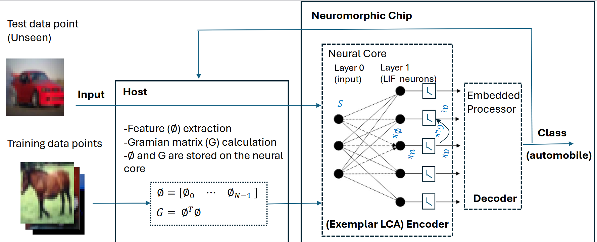

This work proposes D-SELD, an innovative Exemplar LCA Encoder-Decoder technique that leverages sparse coding and the Locally Competitive Algorithm (LCA) to provide a scalable training algorithm tailored for low-power neuromorphic platforms. By constructing a dictionary directly from features extracted from training datasets, D-SELD eliminates the computationally expensive dictionary training process, enabling efficient deployment on neuromorphic hardware. The approach achieves top-1 accuracies of 99.99% on MNIST, 94.98% on CIFAR-10, 79.32% on CIFAR-100, and 80.79% on ImageNet LSVRC2012, outperforming or matching state-of-the-art spiking neural network methods without relying on error backpropagation. D-SELD's sparsity, driven by firing neurons inhibiting non-firing ones, reduces computational and memory demands, with inference workloads as low as 0.25 GFLOPs using VGG-16 features. The framework supports incremental addition of new training examples, making it adaptable to datasets of any size. Compatibility with memristor-based crossbar arrays further enhances its suitability for energy-efficient, neuromorphic computing applications, demonstrating significant potential for scalable, low-power AI systems. [📄 Read the published article](https://iopscience.iop.org/article/10.1088/2634-4386/ad9e2c)
