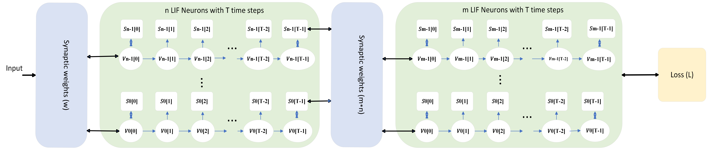

This work introduces ROUSER, a novel approach that promotes neuron spiking thresholds from hyperparameters to trainable parameters in spiking neural networks, addressing the critical issue of dead neurons during training. By integrating adaptive threshold learning with surrogate gradient-based error backpropagation, ROUSER enhances training dynamics, achieving up to a 30% reduction in training epochs and a 2% increase in top-1 accuracy on neuromorphic datasets, including NMNIST (95.2%), DVS128 (86.6%), and Spiking Heidelberg Digits (78.14%). Unlike traditional methods that rely on offline grid searches for threshold tuning, ROUSER dynamically adjusts thresholds, mitigating the non-differentiable nature of spiking functions and improving convergence robustness. The approach significantly reduces dead neuron occurrences, enabling more effective feature representation and faster training. Evaluated using the SLAYER framework from Lava-DL, ROUSER demonstrates superior performance over baseline SNN training, highlighting its potential for scalable, energy-efficient neuromorphic computing applications.
[📄 Read the full paper (PDF)](../files/ROUSER.pdf)
