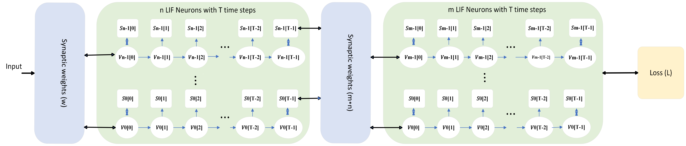

(A Threshold Learning Rule for Robust SNN Training)

This work focuses on the significance of learning neuron thresholds alongside weights in SNNs. Our results suggest that promoting threshold from a hyperparameter to a trainable parameter effectively addresses the issue of dead neurons during training. This leads to a more robust training algorithm, resulting in improved convergence, increased test accuracy, and a substantial reduction in the number of training epochs required to achieve viable accuracy.  
[📄 Read the full paper (PDF)](../files/ROUSER.pdf)